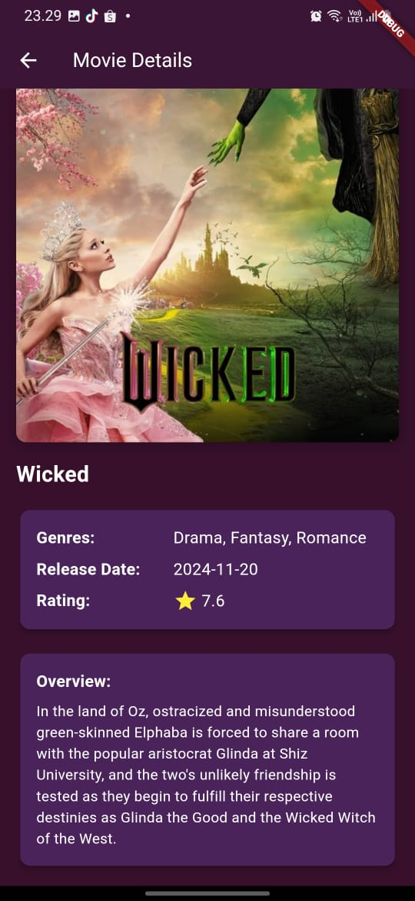

# movie_recommendation_apps

## Overview

This is a Flutter project for a movie recommendation app. The app provides users with an intuitive and informative interface to explore popular movies, latest releases, and movies by category. 

## Getting Started

This project is a starting point for a Flutter application. To get started, ensure you have Flutter installed on your machine. You can follow these resources if this is your first Flutter project:

- [Lab: Write your first Flutter app](https://docs.flutter.dev/get-started/codelab)
- [Cookbook: Useful Flutter samples](https://docs.flutter.dev/cookbook)

For more help with Flutter development, you can view the [online documentation](https://docs.flutter.dev/), which offers tutorials, samples, guidance on mobile development, and a full API reference.

## Features

The application offers several key features:
1. **Welcome Screen**: A welcoming interface that greets the user and provides search functionality.
2. **Categories Section**: Displays different genres of movies that users can explore.
3. **Popular Movies**: Lists movies that are currently popular.
4. **Latest Movies**: Shows movies that have been recently released.
5. **Movie Details**: Provides detailed information about a selected movie, including genre, release date, rating, and overview.

### Welcome Screen

*Description: The welcome screen displays a greeting message and a search bar for users to find movies easily.*
### Categories Section
*Description: This section shows different movie genres that users can browse.*

### Popular Movies

*Description: The popular movies section lists films that are trending and widely watched.*
### Latest Movies
*Description: Shows the most recent films that have been released.*

### Movie Details

*Description: This page provides in-depth information about a specific movie, including its title, genres, release date, rating, and a brief overview.*

## API References

This application utilizes the API from **The Movie Database (TMDB)** to fetch movie data. TMDB provides comprehensive information on movies, including popular movies, genre-specific movies, and detailed information on individual movies. Below are the key endpoints used in this application:

### Endpoints

1. **Popular Movies**
   - **URL**: `https://api.themoviedb.org/3/movie/popular?api_key={API_KEY}&language=en-US&page=1`
   - **Description**: Fetches a list of popular movies currently available.

2. **Movie Genres**
   - **URL**: `https://api.themoviedb.org/3/genre/movie/list?api_key={API_KEY}&language=en-US`
   - **Description**: Retrieves a list of movie genres.

3. **Movies by Genre**
   - **URL**: `https://api.themoviedb.org/3/discover/movie?api_key={API_KEY}&with_genres={GENRE_ID}`
   - **Description**: Fetches movies based on a specific genre.

4. **Movie Details**
   - **URL**: `https://api.themoviedb.org/3/movie/{MOVIE_ID}?api_key={API_KEY}&language=en-US`
   - **Description**: Retrieves detailed information about a specific movie using the movie ID.

5. **Latest Movies**
   - **URL**: `https://api.themoviedb.org/3/movie/now_playing?api_key={API_KEY}&language=en-US&page=1`
   - **Description**: Fetches a list of movies currently playing in theaters.

### How to Use the API

To use the TMDB API, you need to register an account on TMDB and obtain an API Key. Replace `{API_KEY}` in the URLs above with your own API Key to authenticate your requests.

